# Database Design — Bikers Community Platform

> PostgreSQL with PostGIS extension for spatial queries

---

## Table of Contents

- [Entity-Relationship Overview](#entity-relationship-overview)
- [Core Tables](#core-tables)
- [Rides & Routes Tables](#rides--routes-tables)
- [Community Tables](#community-tables)
- [Rewards Tables](#rewards-tables)
- [Notifications & Settings Tables](#notifications--settings-tables)
- [Support Tables](#support-tables)
- [Security Tables](#security-tables)
- [Indexing Strategy](#indexing-strategy)
- [Data Policies](#data-policies)

---

## Entity-Relationship Overview

```mermaid
erDiagram
    riders ||--o{ vehicles : owns
    riders ||--o{ gear : has
    riders ||--o{ ride_participants : joins
    riders ||--o{ posts : creates
    riders ||--o{ comments : writes
    riders ||--o{ likes : gives
    riders ||--o{ follows : follows
    riders ||--o{ rider_badges : earns
    riders ||--o{ rider_achievements : progresses
    riders ||--o{ notifications : receives
    riders ||--o{ support_tickets : submits
    riders ||--|| rider_settings : has
    riders ||--|| rider_privacy_settings : has
    riders ||--o{ login_activity : logs
    riders ||--o{ sessions : has
    riders ||--o{ blocked_riders : blocks

    rides ||--o{ ride_participants : has
    rides ||--o{ ride_stops : includes
    rides ||--o{ ride_reviews : receives
    rides ||--o{ routes : has
    rides ||--o{ gps_traces : records

    routes ||--o{ route_bookmarks : bookmarked_by
    routes ||--o{ route_shares : shared_via

    posts ||--o{ comments : has
    posts ||--o{ likes : has

    groups ||--o{ group_members : contains

    badges ||--o{ rider_badges : awarded_as
    achievements ||--o{ rider_achievements : tracked_in
```

---

## Core Tables

### `riders`

Primary user table. Soft-deletable with a grace period.

| Column                | Type                     | Constraints                     | Notes                                |
| --------------------- | ------------------------ | ------------------------------- | ------------------------------------ |
| `id`                  | `UUID`                   | PK, DEFAULT `gen_random_uuid()` |                                      |
| `email`               | `VARCHAR(255)`           | UNIQUE, NOT NULL                |                                      |
| `password_hash`       | `VARCHAR(255)`           | NOT NULL                        | bcrypt or Argon2id                   |
| `display_name`        | `VARCHAR(100)`           | NOT NULL                        |                                      |
| `bio`                 | `TEXT`                   |                                 |                                      |
| `profile_picture_url` | `TEXT`                   |                                 | S3/object storage URL                |
| `experience_level`    | `VARCHAR(20)`            | DEFAULT `'beginner'`            | `beginner`, `intermediate`, `expert` |
| `location_city`       | `VARCHAR(100)`           |                                 |                                      |
| `location_region`     | `VARCHAR(100)`           |                                 |                                      |
| `location_coords`     | `GEOGRAPHY(Point, 4326)` |                                 | PostGIS point for regional queries   |
| `phone_number`        | `VARCHAR(20)`            |                                 |                                      |
| `weight_kg`           | `DECIMAL(5,2)`           |                                 | Used for calorie estimation          |
| `total_rides`         | `INT`                    | DEFAULT `0`                     | Denormalized counter                 |
| `total_distance_km`   | `DECIMAL(10,2)`          | DEFAULT `0`                     | Denormalized counter                 |
| `total_ride_time_sec` | `BIGINT`                 | DEFAULT `0`                     | Denormalized counter                 |
| `two_factor_enabled`  | `BOOLEAN`                | DEFAULT `false`                 |                                      |
| `two_factor_secret`   | `VARCHAR(255)`           |                                 | TOTP secret (encrypted)              |
| `created_at`          | `TIMESTAMPTZ`            | DEFAULT `now()`                 |                                      |
| `updated_at`          | `TIMESTAMPTZ`            | DEFAULT `now()`                 |                                      |
| `deleted_at`          | `TIMESTAMPTZ`            |                                 | Soft-delete; purged after 30 days    |

---

### `vehicles`

One rider can have multiple vehicles.

| Column               | Type           | Constraints                | Notes                 |
| -------------------- | -------------- | -------------------------- | --------------------- |
| `id`                 | `UUID`         | PK                         |                       |
| `rider_id`           | `UUID`         | FK → `riders.id`, NOT NULL |                       |
| `make`               | `VARCHAR(100)` | NOT NULL                   | e.g., "Royal Enfield" |
| `model`              | `VARCHAR(100)` | NOT NULL                   | e.g., "Classic 350"   |
| `year`               | `INT`          |                            |                       |
| `engine_capacity_cc` | `INT`          |                            |                       |
| `created_at`         | `TIMESTAMPTZ`  | DEFAULT `now()`            |                       |

---

### `gear`

Riding gear owned by a rider.

| Column       | Type           | Constraints                | Notes                              |
| ------------ | -------------- | -------------------------- | ---------------------------------- |
| `id`         | `UUID`         | PK                         |                                    |
| `rider_id`   | `UUID`         | FK → `riders.id`, NOT NULL |                                    |
| `type`       | `VARCHAR(50)`  | NOT NULL                   | e.g., "helmet", "jacket", "gloves" |
| `brand`      | `VARCHAR(100)` |                            |                                    |
| `model`      | `VARCHAR(100)` |                            |                                    |
| `created_at` | `TIMESTAMPTZ`  | DEFAULT `now()`            |                                    |

---

## Rides & Routes Tables

### `rides`

Central rides table with state machine: `draft → scheduled → active → completed | cancelled`.

| Column                   | Type                     | Constraints                  | Notes                                                                                            |
| ------------------------ | ------------------------ | ---------------------------- | ------------------------------------------------------------------------------------------------ |
| `id`                     | `UUID`                   | PK                           |                                                                                                  |
| `captain_id`             | `UUID`                   | FK → `riders.id`, NOT NULL   | Ride creator                                                                                     |
| `title`                  | `VARCHAR(255)`           | NOT NULL                     |                                                                                                  |
| `description`            | `TEXT`                   |                              |                                                                                                  |
| `status`                 | `VARCHAR(20)`            | NOT NULL, DEFAULT `'draft'`  | `draft`, `scheduled`, `active`, `completed`, `cancelled`                                         |
| `visibility`             | `VARCHAR(20)`            | NOT NULL, DEFAULT `'public'` | `public`, `private`                                                                              |
| `start_point`            | `GEOGRAPHY(Point, 4326)` |                              | PostGIS                                                                                          |
| `end_point`              | `GEOGRAPHY(Point, 4326)` |                              | PostGIS                                                                                          |
| `start_point_auto`       | `BOOLEAN`                | DEFAULT `false`              | If `true`, centroid-calculated                                                                   |
| `route_geojson`          | `JSONB`                  |                              | GeoJSON LineString for the route                                                                 |
| `scheduled_at`           | `TIMESTAMPTZ`            |                              | Date/time of ride                                                                                |
| `estimated_duration_min` | `INT`                    |                              |                                                                                                  |
| `max_capacity`           | `INT`                    |                              | NULL = unlimited                                                                                 |
| `current_rider_count`    | `INT`                    | DEFAULT `0`                  | Atomic counter with optimistic lock                                                              |
| `requirements`           | `JSONB`                  |                              | `{"min_experience": "intermediate", "vehicle_type": "motorcycle", "mandatory_gear": ["helmet"]}` |
| `average_rating`         | `DECIMAL(3,2)`           |                              | Denormalized from `ride_reviews`                                                                 |
| `created_at`             | `TIMESTAMPTZ`            | DEFAULT `now()`              |                                                                                                  |
| `updated_at`             | `TIMESTAMPTZ`            | DEFAULT `now()`              |                                                                                                  |

---

### `ride_participants`

Join table linking riders to rides, with role and status tracking.

| Column              | Type                     | Constraints                | Notes                                                          |
| ------------------- | ------------------------ | -------------------------- | -------------------------------------------------------------- |
| `id`                | `UUID`                   | PK                         |                                                                |
| `ride_id`           | `UUID`                   | FK → `rides.id`, NOT NULL  |                                                                |
| `rider_id`          | `UUID`                   | FK → `riders.id`, NOT NULL |                                                                |
| `role`              | `VARCHAR(20)`            | DEFAULT `'rider'`          | `captain`, `co_captain`, `rider`                               |
| `status`            | `VARCHAR(20)`            | NOT NULL                   | `invited`, `requested`, `confirmed`, `dropped_out`, `rejected` |
| `joined_at`         | `TIMESTAMPTZ`            |                            |                                                                |
| `left_at`           | `TIMESTAMPTZ`            |                            |                                                                |
| `dropout_coords`    | `GEOGRAPHY(Point, 4326)` |                            | GPS coords at drop-out                                         |
| `invite_token`      | `VARCHAR(255)`           |                            | Signed JWT/HMAC token                                          |
| `invite_expires_at` | `TIMESTAMPTZ`            |                            |                                                                |
| `created_at`        | `TIMESTAMPTZ`            | DEFAULT `now()`            |                                                                |

> **Unique constraint**: `(ride_id, rider_id)` — a rider can only appear once per ride.

---

### `ride_stops`

Stops during a ride (fuel, rest, photo, unplanned).

| Column         | Type                     | Constraints               | Notes                                |
| -------------- | ------------------------ | ------------------------- | ------------------------------------ |
| `id`           | `UUID`                   | PK                        |                                      |
| `ride_id`      | `UUID`                   | FK → `rides.id`, NOT NULL |                                      |
| `requested_by` | `UUID`                   | FK → `riders.id`          |                                      |
| `approved_by`  | `UUID`                   | FK → `riders.id`          | Captain/co-captain                   |
| `type`         | `VARCHAR(20)`            | NOT NULL                  | `fuel`, `rest`, `photo`, `unplanned` |
| `location`     | `GEOGRAPHY(Point, 4326)` |                           |                                      |
| `status`       | `VARCHAR(20)`            | DEFAULT `'pending'`       | `pending`, `approved`, `rejected`    |
| `stopped_at`   | `TIMESTAMPTZ`            |                           |                                      |
| `resumed_at`   | `TIMESTAMPTZ`            |                           |                                      |
| `created_at`   | `TIMESTAMPTZ`            | DEFAULT `now()`           |                                      |

---

### `routes`

Standalone route objects stored as GeoJSON, shareable and reusable.

| Column                   | Type            | Constraints                | Notes                                                        |
| ------------------------ | --------------- | -------------------------- | ------------------------------------------------------------ |
| `id`                     | `UUID`          | PK                         |                                                              |
| `creator_id`             | `UUID`          | FK → `riders.id`, NOT NULL |                                                              |
| `ride_id`                | `UUID`          | FK → `rides.id`            | NULL if standalone route                                     |
| `parent_route_id`        | `UUID`          | FK → `routes.id`           | For alternate route proposals                                |
| `title`                  | `VARCHAR(255)`  |                            |                                                              |
| `geojson`                | `JSONB`         | NOT NULL                   | GeoJSON LineString                                           |
| `distance_km`            | `DECIMAL(10,2)` |                            |                                                              |
| `elevation_gain_m`       | `DECIMAL(8,2)`  |                            |                                                              |
| `elevation_loss_m`       | `DECIMAL(8,2)`  |                            |                                                              |
| `difficulty`             | `VARCHAR(20)`   |                            | `easy`, `moderate`, `hard`                                   |
| `visibility`             | `VARCHAR(20)`   | DEFAULT `'private'`        | ACL: `private`, `specific_riders`, `public`                  |
| `proposal_status`        | `VARCHAR(20)`   |                            | `pending`, `accepted`, `rejected`, `merged` (for alternates) |
| `share_token`            | `VARCHAR(255)`  |                            | Tokenized URL for external sharing                           |
| `share_token_expires_at` | `TIMESTAMPTZ`   |                            |                                                              |
| `created_at`             | `TIMESTAMPTZ`   | DEFAULT `now()`            |                                                              |

---

### `route_shares`

ACL entries: who can see a specific route.

| Column                 | Type          | Constraints                | Notes |
| ---------------------- | ------------- | -------------------------- | ----- |
| `id`                   | `UUID`        | PK                         |       |
| `route_id`             | `UUID`        | FK → `routes.id`, NOT NULL |       |
| `shared_with_rider_id` | `UUID`        | FK → `riders.id`, NOT NULL |       |
| `created_at`           | `TIMESTAMPTZ` | DEFAULT `now()`            |       |

---

### `route_bookmarks`

| Column       | Type          | Constraints                | Notes |
| ------------ | ------------- | -------------------------- | ----- |
| `id`         | `UUID`        | PK                         |       |
| `route_id`   | `UUID`        | FK → `routes.id`, NOT NULL |       |
| `rider_id`   | `UUID`        | FK → `riders.id`, NOT NULL |       |
| `created_at` | `TIMESTAMPTZ` | DEFAULT `now()`            |       |

> **Unique constraint**: `(route_id, rider_id)`

---

### `gps_traces`

Time-series GPS data recorded during rides.

| Column        | Type            | Constraints                | Notes |
| ------------- | --------------- | -------------------------- | ----- |
| `id`          | `UUID`          | PK                         |       |
| `ride_id`     | `UUID`          | FK → `rides.id`, NOT NULL  |       |
| `rider_id`    | `UUID`          | FK → `riders.id`, NOT NULL |       |
| `latitude`    | `DECIMAL(10,7)` | NOT NULL                   |       |
| `longitude`   | `DECIMAL(10,7)` | NOT NULL                   |       |
| `altitude_m`  | `DECIMAL(7,2)`  |                            |       |
| `speed_kmh`   | `DECIMAL(6,2)`  |                            |       |
| `recorded_at` | `TIMESTAMPTZ`   | NOT NULL                   |       |

> **Index**: `(ride_id, rider_id, recorded_at)` for efficient trace retrieval.
> Consider partitioning by `recorded_at` month for large-scale data.

---

### `ride_history_stats`

Pre-computed per-rider-per-ride analytics (calculated by background job after ride completion).

| Column              | Type            | Constraints                | Notes     |
| ------------------- | --------------- | -------------------------- | --------- |
| `id`                | `UUID`          | PK                         |           |
| `ride_id`           | `UUID`          | FK → `rides.id`, NOT NULL  |           |
| `rider_id`          | `UUID`          | FK → `riders.id`, NOT NULL |           |
| `total_distance_km` | `DECIMAL(10,2)` |                            |           |
| `total_time_sec`    | `INT`           |                            |           |
| `moving_time_sec`   | `INT`           |                            |           |
| `avg_speed_kmh`     | `DECIMAL(6,2)`  |                            |           |
| `max_speed_kmh`     | `DECIMAL(6,2)`  |                            |           |
| `elevation_gain_m`  | `DECIMAL(8,2)`  |                            |           |
| `elevation_loss_m`  | `DECIMAL(8,2)`  |                            |           |
| `calories_burned`   | `INT`           |                            | Estimated |
| `computed_at`       | `TIMESTAMPTZ`   | DEFAULT `now()`            |           |

> **Unique constraint**: `(ride_id, rider_id)`

---

## Community Tables

### `posts`

| Column            | Type          | Constraints                | Notes                  |
| ----------------- | ------------- | -------------------------- | ---------------------- |
| `id`              | `UUID`        | PK                         |                        |
| `rider_id`        | `UUID`        | FK → `riders.id`, NOT NULL |                        |
| `content`         | `TEXT`        |                            |                        |
| `media_urls`      | `TEXT[]`      |                            | Array of S3 URLs       |
| `shared_route_id` | `UUID`        | FK → `routes.id`           | If post shares a route |
| `like_count`      | `INT`         | DEFAULT `0`                | Denormalized           |
| `comment_count`   | `INT`         | DEFAULT `0`                | Denormalized           |
| `created_at`      | `TIMESTAMPTZ` | DEFAULT `now()`            |                        |
| `updated_at`      | `TIMESTAMPTZ` | DEFAULT `now()`            |                        |

---

### `comments`

| Column       | Type          | Constraints                | Notes                        |
| ------------ | ------------- | -------------------------- | ---------------------------- |
| `id`         | `UUID`        | PK                         |                              |
| `post_id`    | `UUID`        | FK → `posts.id`, NOT NULL  |                              |
| `rider_id`   | `UUID`        | FK → `riders.id`, NOT NULL |                              |
| `content`    | `TEXT`        | NOT NULL                   |                              |
| `mentions`   | `UUID[]`      |                            | Parsed @mentions → rider IDs |
| `created_at` | `TIMESTAMPTZ` | DEFAULT `now()`            |                              |
| `updated_at` | `TIMESTAMPTZ` | DEFAULT `now()`            |                              |

---

### `likes`

| Column       | Type          | Constraints                | Notes |
| ------------ | ------------- | -------------------------- | ----- |
| `id`         | `UUID`        | PK                         |       |
| `post_id`    | `UUID`        | FK → `posts.id`, NOT NULL  |       |
| `rider_id`   | `UUID`        | FK → `riders.id`, NOT NULL |       |
| `created_at` | `TIMESTAMPTZ` | DEFAULT `now()`            |       |

> **Unique constraint**: `(post_id, rider_id)`

---

### `follows`

| Column         | Type          | Constraints                | Notes   |
| -------------- | ------------- | -------------------------- | ------- |
| `follower_id`  | `UUID`        | FK → `riders.id`, NOT NULL | PK part |
| `following_id` | `UUID`        | FK → `riders.id`, NOT NULL | PK part |
| `created_at`   | `TIMESTAMPTZ` | DEFAULT `now()`            |         |

> **Primary key**: `(follower_id, following_id)`

---

### `groups`

| Column        | Type           | Constraints                | Notes               |
| ------------- | -------------- | -------------------------- | ------------------- |
| `id`          | `UUID`         | PK                         |                     |
| `name`        | `VARCHAR(255)` | NOT NULL                   |                     |
| `description` | `TEXT`         |                            |                     |
| `visibility`  | `VARCHAR(20)`  | DEFAULT `'public'`         | `public`, `private` |
| `created_by`  | `UUID`         | FK → `riders.id`, NOT NULL |                     |
| `created_at`  | `TIMESTAMPTZ`  | DEFAULT `now()`            |                     |

---

### `group_members`

| Column      | Type          | Constraints                | Notes             |
| ----------- | ------------- | -------------------------- | ----------------- |
| `group_id`  | `UUID`        | FK → `groups.id`, NOT NULL | PK part           |
| `rider_id`  | `UUID`        | FK → `riders.id`, NOT NULL | PK part           |
| `role`      | `VARCHAR(20)` | DEFAULT `'member'`         | `admin`, `member` |
| `joined_at` | `TIMESTAMPTZ` | DEFAULT `now()`            |                   |

---

### `ride_reviews`

| Column        | Type          | Constraints                | Notes |
| ------------- | ------------- | -------------------------- | ----- |
| `id`          | `UUID`        | PK                         |       |
| `ride_id`     | `UUID`        | FK → `rides.id`, NOT NULL  |       |
| `rider_id`    | `UUID`        | FK → `riders.id`, NOT NULL |       |
| `rating`      | `SMALLINT`    | NOT NULL, CHECK `1–5`      |       |
| `review_text` | `TEXT`        |                            |       |
| `created_at`  | `TIMESTAMPTZ` | DEFAULT `now()`            |       |

> **Unique constraint**: `(ride_id, rider_id)` — one review per rider per ride.

---

## Rewards Tables

### `badges`

Data-driven badge definitions. Add new badges without code changes.

| Column           | Type            | Constraints      | Notes                                                |
| ---------------- | --------------- | ---------------- | ---------------------------------------------------- |
| `id`             | `UUID`          | PK               |                                                      |
| `name`           | `VARCHAR(100)`  | NOT NULL, UNIQUE | e.g., "First Ride", "Night Rider"                    |
| `description`    | `TEXT`          |                  |                                                      |
| `icon_url`       | `TEXT`          |                  |                                                      |
| `criteria_type`  | `VARCHAR(50)`   | NOT NULL         | e.g., `total_rides`, `total_distance`, `night_rides` |
| `criteria_value` | `DECIMAL(10,2)` | NOT NULL         | Threshold to earn                                    |
| `created_at`     | `TIMESTAMPTZ`   | DEFAULT `now()`  |                                                      |

---

### `rider_badges`

| Column       | Type          | Constraints                | Notes |
| ------------ | ------------- | -------------------------- | ----- |
| `id`         | `UUID`        | PK                         |       |
| `rider_id`   | `UUID`        | FK → `riders.id`, NOT NULL |       |
| `badge_id`   | `UUID`        | FK → `badges.id`, NOT NULL |       |
| `awarded_at` | `TIMESTAMPTZ` | DEFAULT `now()`            |       |

> **Unique constraint**: `(rider_id, badge_id)`

---

### `achievements`

Tiered milestones.

| Column               | Type            | Constraints     | Notes                                 |
| -------------------- | --------------- | --------------- | ------------------------------------- |
| `id`                 | `UUID`          | PK              |                                       |
| `name`               | `VARCHAR(100)`  | NOT NULL        | e.g., "Distance Pro"                  |
| `tier`               | `SMALLINT`      | NOT NULL        | 1, 2, 3, ...                          |
| `threshold`          | `DECIMAL(10,2)` | NOT NULL        | Value required for this tier          |
| `criteria_type`      | `VARCHAR(50)`   | NOT NULL        | e.g., `total_distance`, `total_rides` |
| `reward_description` | `TEXT`          |                 | Flair/cosmetic unlock                 |
| `created_at`         | `TIMESTAMPTZ`   | DEFAULT `now()` |                                       |

> **Unique constraint**: `(name, tier)`

---

### `rider_achievements`

| Column           | Type            | Constraints                      | Notes                |
| ---------------- | --------------- | -------------------------------- | -------------------- |
| `id`             | `UUID`          | PK                               |                      |
| `rider_id`       | `UUID`          | FK → `riders.id`, NOT NULL       |                      |
| `achievement_id` | `UUID`          | FK → `achievements.id`, NOT NULL |                      |
| `current_value`  | `DECIMAL(10,2)` | DEFAULT `0`                      | Progress so far      |
| `current_tier`   | `SMALLINT`      | DEFAULT `0`                      | Highest tier reached |
| `updated_at`     | `TIMESTAMPTZ`   | DEFAULT `now()`                  |                      |

> **Unique constraint**: `(rider_id, achievement_id)`

---

## Notifications & Settings Tables

### `notifications`

In-app notifications, delivered via WebSocket or REST polling.

| Column       | Type           | Constraints                | Notes                                                                 |
| ------------ | -------------- | -------------------------- | --------------------------------------------------------------------- |
| `id`         | `UUID`         | PK                         |                                                                       |
| `rider_id`   | `UUID`         | FK → `riders.id`, NOT NULL | Recipient                                                             |
| `type`       | `VARCHAR(50)`  | NOT NULL                   | `ride_invite`, `join_request`, `badge_unlock`, `community_post`, etc. |
| `title`      | `VARCHAR(255)` |                            |                                                                       |
| `body`       | `TEXT`         |                            |                                                                       |
| `data`       | `JSONB`        |                            | Payload (ride_id, post_id, etc.)                                      |
| `is_read`    | `BOOLEAN`      | DEFAULT `false`            |                                                                       |
| `created_at` | `TIMESTAMPTZ`  | DEFAULT `now()`            |                                                                       |

---

### `notification_preferences`

Per-rider, per-type delivery channel preferences.

| Column              | Type          | Constraints                | Notes                        |
| ------------------- | ------------- | -------------------------- | ---------------------------- |
| `id`                | `UUID`        | PK                         |                              |
| `rider_id`          | `UUID`        | FK → `riders.id`, NOT NULL |                              |
| `notification_type` | `VARCHAR(50)` | NOT NULL                   | Matches `notifications.type` |
| `push_enabled`      | `BOOLEAN`     | DEFAULT `true`             |                              |
| `in_app_enabled`    | `BOOLEAN`     | DEFAULT `true`             |                              |
| `email_enabled`     | `BOOLEAN`     | DEFAULT `false`            |                              |

> **Unique constraint**: `(rider_id, notification_type)`

---

### `rider_settings`

General preferences stored as a JSONB document for flexibility.

| Column          | Type          | Constraints            | Notes                  |
| --------------- | ------------- | ---------------------- | ---------------------- |
| `rider_id`      | `UUID`        | PK, FK → `riders.id`   |                        |
| `theme`         | `VARCHAR(10)` | DEFAULT `'dark'`       | `dark`, `light`        |
| `language`      | `VARCHAR(10)` | DEFAULT `'en'`         |                        |
| `distance_unit` | `VARCHAR(5)`  | DEFAULT `'km'`         | `km`, `mi`             |
| `speed_unit`    | `VARCHAR(5)`  | DEFAULT `'kmh'`        | `kmh`, `mph`           |
| `date_format`   | `VARCHAR(20)` | DEFAULT `'YYYY-MM-DD'` |                        |
| `extra`         | `JSONB`       |                        | Future-proof extension |
| `updated_at`    | `TIMESTAMPTZ` | DEFAULT `now()`        |                        |

---

### `rider_privacy_settings`

| Column                    | Type          | Constraints          | Notes                                  |
| ------------------------- | ------------- | -------------------- | -------------------------------------- |
| `rider_id`                | `UUID`        | PK, FK → `riders.id` |                                        |
| `profile_visibility`      | `VARCHAR(20)` | DEFAULT `'public'`   | `public`, `riders_only`, `private`     |
| `ride_history_visibility` | `VARCHAR(20)` | DEFAULT `'public'`   | `public`, `riders_only`, `private`     |
| `leaderboard_opt_in`      | `BOOLEAN`     | DEFAULT `true`       |                                        |
| `invite_permission`       | `VARCHAR(20)` | DEFAULT `'everyone'` | `everyone`, `followers_only`, `no_one` |
| `updated_at`              | `TIMESTAMPTZ` | DEFAULT `now()`      |                                        |

---

### `blocked_riders`

| Column       | Type          | Constraints                | Notes   |
| ------------ | ------------- | -------------------------- | ------- |
| `blocker_id` | `UUID`        | FK → `riders.id`, NOT NULL | PK part |
| `blocked_id` | `UUID`        | FK → `riders.id`, NOT NULL | PK part |
| `created_at` | `TIMESTAMPTZ` | DEFAULT `now()`            |         |

---

## Security Tables

### `login_activity`

| Column               | Type           | Constraints                | Notes                      |
| -------------------- | -------------- | -------------------------- | -------------------------- |
| `id`                 | `UUID`         | PK                         |                            |
| `rider_id`           | `UUID`         | FK → `riders.id`, NOT NULL |                            |
| `device_fingerprint` | `VARCHAR(255)` |                            |                            |
| `ip_address`         | `INET`         |                            | PostgreSQL native type     |
| `geo_location`       | `VARCHAR(255)` |                            | City/country via IP lookup |
| `logged_in_at`       | `TIMESTAMPTZ`  | DEFAULT `now()`            |                            |

---

### `sessions`

Active sessions managed via refresh tokens.

| Column               | Type           | Constraints                | Notes                |
| -------------------- | -------------- | -------------------------- | -------------------- |
| `id`                 | `UUID`         | PK                         |                      |
| `rider_id`           | `UUID`         | FK → `riders.id`, NOT NULL |                      |
| `refresh_token_hash` | `VARCHAR(255)` | NOT NULL                   | Hashed refresh token |
| `device_info`        | `VARCHAR(255)` |                            |                      |
| `ip_address`         | `INET`         |                            |                      |
| `created_at`         | `TIMESTAMPTZ`  | DEFAULT `now()`            |                      |
| `expires_at`         | `TIMESTAMPTZ`  | NOT NULL                   |                      |
| `revoked_at`         | `TIMESTAMPTZ`  |                            | NULL = active        |

---

## Support Tables

### `support_tickets`

| Column            | Type           | Constraints                | Notes                                                         |
| ----------------- | -------------- | -------------------------- | ------------------------------------------------------------- |
| `id`              | `UUID`         | PK                         |                                                               |
| `rider_id`        | `UUID`         | FK → `riders.id`, NOT NULL |                                                               |
| `category`        | `VARCHAR(50)`  | NOT NULL                   | `bug`, `dispute`, `account`, `general`                        |
| `subject`         | `VARCHAR(255)` | NOT NULL                   |                                                               |
| `description`     | `TEXT`         | NOT NULL                   |                                                               |
| `attachment_urls` | `TEXT[]`       |                            | Screenshots in object storage                                 |
| `status`          | `VARCHAR(20)`  | DEFAULT `'open'`           | `open`, `in_progress`, `awaiting_rider`, `resolved`, `closed` |
| `created_at`      | `TIMESTAMPTZ`  | DEFAULT `now()`            |                                                               |
| `updated_at`      | `TIMESTAMPTZ`  | DEFAULT `now()`            |                                                               |

---

## Indexing Strategy

| Table               | Index                                  | Type                             | Purpose                                |
| ------------------- | -------------------------------------- | -------------------------------- | -------------------------------------- |
| `riders`            | `email`                                | UNIQUE B-tree                    | Login lookup                           |
| `riders`            | `location_coords`                      | GiST (spatial)                   | Regional queries & leaderboard         |
| `riders`            | `deleted_at`                           | B-tree (partial, WHERE NOT NULL) | Purge job                              |
| `rides`             | `status, scheduled_at`                 | B-tree composite                 | Active/upcoming ride queries           |
| `rides`             | `captain_id`                           | B-tree                           | Captain's ride list                    |
| `rides`             | `start_point`, `end_point`             | GiST (spatial)                   | Nearby ride discovery                  |
| `ride_participants` | `(ride_id, rider_id)`                  | UNIQUE B-tree                    | Dedup & join lookup                    |
| `ride_participants` | `(rider_id, status)`                   | B-tree composite                 | Conflict detection (overlapping rides) |
| `gps_traces`        | `(ride_id, rider_id, recorded_at)`     | B-tree composite                 | Trace retrieval                        |
| `posts`             | `rider_id, created_at DESC`            | B-tree composite                 | Profile feed                           |
| `posts`             | `created_at DESC`                      | B-tree                           | Community feed                         |
| `notifications`     | `(rider_id, is_read, created_at DESC)` | B-tree composite                 | Unread notifications                   |
| `follows`           | `(follower_id)`, `(following_id)`      | B-tree                           | Follow graph lookups                   |

---

## Data Policies

| Policy               | Details                                                                                                                                                                                       |
| -------------------- | --------------------------------------------------------------------------------------------------------------------------------------------------------------------------------------------- |
| **Soft Delete**      | `riders.deleted_at` — record retained for 30-day grace period, then permanently purged by scheduled job. Associated data (rides, routes, badges) is anonymized or deleted.                    |
| **Canonical Units**  | All distances stored in **km**, speeds in **km/h**, weights in **kg**, timestamps in **UTC** (`TIMESTAMPTZ`). Unit conversion happens client-side based on `rider_settings`.                  |
| **Denormalization**  | `riders.total_rides`, `riders.total_distance_km`, `posts.like_count`, `posts.comment_count`, `rides.average_rating`, `rides.current_rider_count` — updated via triggers or application logic. |
| **Leaderboard**      | Powered by materialized views aggregating ride stats, refreshed hourly. Riders with `leaderboard_opt_in = false` are excluded.                                                                |
| **GPS Data**         | High-volume `gps_traces` table — consider time-based partitioning (monthly) and archival for rides older than 1 year.                                                                         |
| **Password Storage** | `bcrypt` or `Argon2id` with appropriate cost factors. Never store plaintext.                                                                                                                  |
| **Tokens**           | Invitation and share tokens are signed (JWT/HMAC), time-limited, and stored hashed.                                                                                                           |
