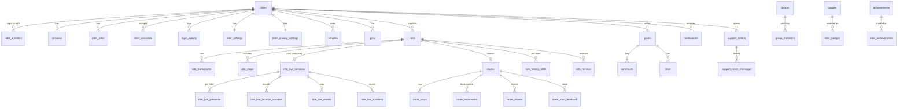

# Database Design — ThrottleBase

PostgreSQL 17 + PostGIS, hosted on **Supabase** (project `throttlebase`, region `ap-south-1` / Mumbai).
Schema lives in plain SQL migrations under `server/src/db/migrations/` (001–036). No ORM.

This document was regenerated from a database built by running every migration, not from a design sketch.
When a migration changes the schema, update the matching table here.

---

## Contents

- [Conventions](#conventions)
- [Migrations and roles](#migrations-and-roles)
- [Row-level security](#row-level-security)
- [Relationship overview](#relationship-overview)
- [Identity and auth](#identity-and-auth)
- [Riders and profile](#riders-and-profile)
- [Rides](#rides)
- [Live sessions and tracking](#live-sessions-and-tracking)
- [Routes](#routes)
- [Community](#community)
- [Rewards](#rewards)
- [Notifications, settings, privacy](#notifications-settings-privacy)
- [Support](#support)
- [Platform tables](#platform-tables)
- [Database functions and triggers](#database-functions-and-triggers)
- [Data policies](#data-policies)

---

## Conventions

- Primary keys are `UUID DEFAULT gen_random_uuid()`, except high-volume append tables (`ride_live_events`, `ride_live_location_samples`), which use `BIGSERIAL`, and natural-key tables (`follows`, `blocked_riders`, `group_members`, `rider_identities`, `rider_roles`, `rider_settings`, `rider_privacy_settings`, `rate_limit_counters`, `google_api_usage`, `stop_suggestion_cache`).
- Points are `GEOGRAPHY(Point, 4326)`. Route lines are GeoJSON `LineString` in `JSONB`.
- Timestamps are `TIMESTAMPTZ` (UTC). Distances are km, speeds km/h, short distances metres. The client converts for display using `rider_settings`.
- Enumerations are `VARCHAR`/`TEXT` with `CHECK` constraints, not Postgres enum types.
- Nearly every foreign key to `riders` is `ON DELETE CASCADE`, so hard-deleting a rider removes their data. Actor columns (`approved_by`, `ended_by`, `acknowledged_by`, …) are `ON DELETE SET NULL`.

## Migrations and roles

- `npm run migrate` (in `server/`) applies pending files in order and records each in `schema_migrations` with a checksum. `npm run migrate:dry-run` lists what would run. `npm run migrate:baseline` records existing files without running them.
- The runner connects with `MIGRATION_DATABASE_URL`, falling back to `DATABASE_URL`.
- Migration 027 creates two roles, both `NOLOGIN` until an operator sets a password out of band:
  - `throttlebase_app` — the intended API role. Owns nothing, no `BYPASSRLS`. Gets `SELECT/INSERT/UPDATE/DELETE` on all tables (including future ones via default privileges), but not `schema_migrations`.
  - `throttlebase_migrator` — for migrations and jobs.
- **Hosted database today:** the API connects to the Supabase project as its `postgres` role, which has `BYPASSRLS`. Both custom roles exist but cannot log in. Verified against the live project on 2026-09-28. See [Row-level security](#row-level-security).
- All 37 migration files (036 is the latest; there are two `004_*` files) are applied to the Supabase project.

## Row-level security

Migration 028 enables RLS on every application table. Policies are written against `app.current_rider_id()`, which reads the transaction-local setting `app.rider_id`.

| Policy group | Tables | Rule |
| --- | --- | --- |
| Strictly per-rider | `sessions`, `rider_identities`, `rider_consents`, `rider_settings`, `rider_privacy_settings`, `login_activity`, `vehicles`, `gear`, `notification_preferences` | `rider_id = app.current_rider_id()` for all operations |
| Owner read-only | `rider_roles` | Owner may `SELECT`; roles are granted out of band |
| `riders` | `riders` | `SELECT` any non-deleted row (or your own); `INSERT` open (sign-up precedes an id); `UPDATE` own row only |
| Pre-auth | `email_otps`, `rate_limit_counters` | Open to the app role (keyed by email/IP, hold digests) |
| Transitional | every ride, route, live, social, support, rewards, jobs and cache table | Open to the app role; marked `FOLLOW-UP` in the migration |

How rider identity is set:

- `withRiderTransaction()` in `server/src/adapters/postgres/requestContext.ts` opens a transaction and runs `set_config('app.rider_id', …, true)`. Transaction-local on purpose: safe behind Supabase's transaction-mode pooler.
- Only the auth adapters (`riderRepository.ts`, `sessionRepository.ts`) use it. The older services in `server/src/services/` query through the shared pool without setting `app.rider_id`.

Consequences:

- Because the API connects as `postgres` (`BYPASSRLS`), **no policy is enforced for the API today**. Authorization rests entirely on application SQL.
- Switching `DATABASE_URL` to `throttlebase_app` as-is would break the older services on the strictly-per-rider tables (for example, `rider_settings` and `notification_preferences` reads would return nothing). Those services must move to `withRiderTransaction` first.
- The integration test `server/src/adapters/postgres/migrations.integration.test.ts` proves the policies work as `throttlebase_app` against a throwaway database.

## Relationship overview

```mermaid
erDiagram
    riders ||--o{ rider_identities : "signs in with"
    riders ||--o{ sessions : has
    riders ||--o{ rider_roles : has
    riders ||--o{ rider_consents : accepts
    riders ||--o{ login_activity : logs
    riders ||--|| rider_settings : has
    riders ||--|| rider_privacy_settings : has
    riders ||--o{ vehicles : owns
    riders ||--o{ gear : has

    riders ||--o{ rides : captains
    rides ||--o{ ride_participants : has
    rides ||--o{ ride_stops : includes
    rides ||--o| ride_live_sessions : "runs (max one)"
    rides }o--o| routes : "follows"
    ride_live_sessions ||--o{ ride_live_presence : "per rider"
    ride_live_sessions ||--o{ ride_live_location_samples : records
    ride_live_sessions ||--o{ ride_live_events : logs
    ride_live_sessions ||--o{ ride_live_incidents : raises
    rides ||--o{ ride_history_stats : "per rider"

    routes ||--o{ route_stops : has
    routes ||--o{ route_bookmarks : bookmarked
    routes ||--o{ route_shares : shared
    routes ||--o{ route_road_feedback : rated

    riders ||--o{ posts : writes
    posts ||--o{ comments : has
    posts ||--o{ likes : has
    groups ||--o{ group_members : contains
    rides ||--o{ ride_reviews : receives

    badges ||--o{ rider_badges : "awarded as"
    achievements ||--o{ rider_achievements : "tracked in"
    riders ||--o{ notifications : receives
    riders ||--o{ support_tickets : opens
    support_tickets ||--o{ support_ticket_messages : thread
```

---

## Identity and auth

Sign-in is passwordless (Google, Apple, email code). Migration 024 dropped `password_hash`, TOTP columns and `is_admin` from `riders`.

### `rider_identities`

One row per external identity. PK `(provider, subject)`.

| Column | Type | Notes |
| --- | --- | --- |
| `provider` | text | `google`, `apple`, `email` |
| `subject` | text | Provider's stable subject id (email address for `email`) |
| `rider_id` | uuid | FK → `riders` |
| `email` | text | Email reported by the provider |
| `created_at` | timestamptz | |

Looked up through `app.rider_id_by_identity()` (security definer), because sign-in runs before a rider id exists.

### `sessions`

Refresh-token sessions with rotation families. Access tokens are stateless JWTs and are not stored.

| Column | Type | Notes |
| --- | --- | --- |
| `id` | uuid | PK |
| `rider_id` | uuid | FK → `riders` |
| `refresh_token_hash` | text | Unique. Hash only; the raw token is never stored |
| `family_id` | uuid | All rotations of one sign-in share a family. Reuse of a rotated token revokes the family |
| `replaced_by` | uuid | FK → `sessions`, the next token in the family |
| `ip_address` | inet | |
| `user_agent` | text | |
| `created_at`, `last_used_at`, `expires_at`, `revoked_at` | timestamptz | |

Indexes: unique `refresh_token_hash`; `family_id`; `rider_id WHERE revoked_at IS NULL`.
Refresh lookup goes through `app.session_by_refresh_hash()` (security definer).

### `rider_roles`

PK `(rider_id, role)`. `role` ∈ `admin`, `support`. Replaces the old `riders.is_admin` flag. Roles are copied into the access token at sign-in/refresh; `requireAdmin` checks the token.

### `rider_consents`

Terms/privacy acceptance log: `rider_id`, `terms_version`, `privacy_version`, `accepted_at`, `ip`. The server refuses account creation when the client's version differs from `TERMS_VERSION` / `PRIVACY_VERSION`.

### `email_otps`

Email sign-in codes: `email`, `code_hash`, `expires_at`, `attempts`, `consumed_at`, `ip`, `created_at`. Index on open codes (`expires_at WHERE consumed_at IS NULL`).

### `rate_limit_counters`

Fixed-window counters used by the auth rate limiter: PK `(bucket, subject, window_start)`, `count`.

### `login_activity`

Written on each successful sign-in: `rider_id`, `device_fingerprint`, `ip_address` (inet), `geo_location`, `logged_in_at`.

---

## Riders and profile

### `riders`

| Column | Type | Notes |
| --- | --- | --- |
| `id` | uuid | PK |
| `email` | varchar(255) | Nullable (Apple can hide it). Unique on `lower(email)` |
| `username` | varchar(50) | Nullable until onboarding. `^[a-z0-9_]{3,20}$`, unique on `lower(username)` |
| `display_name` | varchar(100) | NOT NULL |
| `bio`, `profile_picture_url` | text | |
| `experience_level` | varchar(20) | Default `beginner` |
| `location_city`, `location_region` | varchar(100) | |
| `location_coords` | geography | GiST index |
| `phone_number` | varchar(20) | |
| `weight_kg` | numeric | |
| `total_rides`, `total_distance_km`, `total_ride_time_sec` | int / numeric / bigint | Denormalized; recomputed from `ride_history_stats` |
| `created_at`, `updated_at` | timestamptz | `updated_at` via trigger |
| `deleted_at` | timestamptz | Soft delete; hard-deleted after 30 days by the cleanup job |

`needsOnboarding` in the auth response means `username IS NULL`.

### `vehicles`

`rider_id`, `make`, `model`, `year`, `engine_capacity_cc`, `created_at`.

### `gear`

`rider_id`, `type` (helmet, jacket, …), `brand`, `model`, `created_at`.

---

## Rides

### `rides`

| Column | Type | Notes |
| --- | --- | --- |
| `id` | uuid | PK |
| `captain_id` | uuid | FK → `riders` |
| `title`, `description` | varchar(255) / text | |
| `status` | varchar(20) | `draft`, `scheduled`, `active`, `completed`, `cancelled` |
| `visibility` | varchar(20) | `public`, `private` |
| `start_point`, `end_point` | geography | GiST indexes |
| `start_point_name`, `end_point_name` | varchar(255) | Display names |
| `start_point_auto` | boolean | Start point computed from participants' start overrides |
| `route_geojson` | jsonb | Planned line |
| `route_id` | uuid | FK → `routes`, `ON DELETE SET NULL`. Set when a ride is planned from a saved route |
| `route_reversed` | boolean | Ride follows the route end → start |
| `road_via` | jsonb | Array of intermediate points that keep directions on the route's roads |
| `scheduled_at` | timestamptz | |
| `estimated_duration_min` | int | From Google Directions |
| `max_capacity`, `current_rider_count` | int | |
| `requirements` | jsonb | |
| `average_rating` | numeric | |
| `created_at`, `updated_at` | timestamptz | |

Indexes: `(status, scheduled_at)`, `captain_id`, `route_id`, GiST on both points.

### `ride_participants`

Unique `(ride_id, rider_id)`.

| Column | Type | Notes |
| --- | --- | --- |
| `ride_id`, `rider_id` | uuid | |
| `role` | varchar(20) | `captain`, `co_captain`, `rider` |
| `status` | varchar(20) | `invited`, `requested`, `confirmed`, `dropped_out`, `rejected` |
| `joined_at`, `left_at` | timestamptz | |
| `dropout_coords` | geography | |
| `start_location_override` | geography | Rider's own start, used when `start_point_auto` |
| `invite_token`, `invite_expires_at` | | Unused by current flows |

### `ride_stops`

| Column | Type | Notes |
| --- | --- | --- |
| `ride_id` | uuid | |
| `requested_by`, `approved_by` | uuid | `SET NULL` on rider delete |
| `type` | varchar(20) | `fuel`, `rest`, `photo`, `unplanned` |
| `status` | varchar(20) | `pending`, `approved`, `rejected` |
| `name`, `address`, `google_place_id` | varchar | From place suggestions |
| `sequence` | int | Order along the route |
| `location` | geography | |
| `stopped_at`, `resumed_at`, `created_at` | timestamptz | |

### `ride_reviews`

Unique `(ride_id, rider_id)`. `rating` smallint 1–5, `review_text`.

### `ride_history_stats`

One row per rider per ride, written by the `ride_stats.recompute` job. Unique `(ride_id, rider_id)`.

| Column | Notes |
| --- | --- |
| `total_distance_km` | Riding distance only (stops and walking excluded) |
| `total_time_sec`, `moving_time_sec` | Riding time |
| `avg_speed_kmh`, `max_speed_kmh` | Max ignores implausible fixes |
| `elevation_gain_m`, `elevation_loss_m`, `calories_burned` | Not populated (altitude is not sent over the socket) |
| `computed_at` | |

---

## Live sessions and tracking

### `ride_live_sessions`

At most one per ride (unique `ride_id`).

| Column | Notes |
| --- | --- |
| `status` | `starting`, `active`, `paused`, `ended` |
| `started_by`, `started_at`, `ended_by`, `ended_at`, `ended_reason` | |

### `ride_live_presence`

PK `(session_id, rider_id)`. Presence plus each rider's own progress (migration 032).

| Column | Notes |
| --- | --- |
| `role` | `captain`, `co_captain`, `member` |
| `is_online`, `last_heartbeat_at`, `last_location` | Presence; swept by `live_session.presence_sweep` |
| `ride_started_at` | When this rider's ride began. Samples are kept only from here |
| `finished_at`, `finish_reason`, `finish_location` | `finish_reason` ∈ `arrived`, `left_early`, `group_ended`; both set or both null |
| `arrival_armed` | Rider has been beyond the exit radius once (stops round trips arriving at the start) |
| `arrived_at` | Inside the arrival radius and not yet left |

Partial indexes: awaiting auto-finish (`arrived_at WHERE finished_at IS NULL AND arrived_at IS NOT NULL`), finished rides per rider.

### `ride_live_location_samples`

The recorded track. `BIGSERIAL` PK.

| Column | Notes |
| --- | --- |
| `session_id`, `rider_id` | |
| `location` | geography, NOT NULL |
| `speed_kmh`, `heading_deg`, `accuracy_m` | |
| `activity` | Phone motion reading: `automotive`, `cycling`, `walking`, `running`, `stationary` (migration 036) |
| `captured_at` | Device time |

Indexes: `(session_id, rider_id, captured_at DESC)`, `(session_id, captured_at DESC)`.
A sample is kept when the rider moved ≥ 20 m, 30 s passed, or the motion reading changed (`server/src/realtime/sampleThrottle.ts`).

### `ride_live_events`

Session timeline: `session_id`, `actor_rider_id`, `event_type`, `payload` jsonb, `created_at`. `BIGSERIAL` PK.

### `ride_live_incidents`

| Column | Notes |
| --- | --- |
| `kind` | `sos`, `crash`, `medical`, `mechanical`, `other` |
| `severity` | `low`, `medium`, `high`, `critical` |
| `status` | `open`, `acknowledged`, `resolved` |
| `location`, `metadata` | |
| `acknowledged_by/at`, `resolved_by/at` | |

### `gps_traces`

Legacy batch-upload table (`POST /api/routes/traces`). **No client writes to it**; ride stats read `ride_live_location_samples` instead.

---

## Routes

### `routes`

| Column | Type | Notes |
| --- | --- | --- |
| `id`, `creator_id` | uuid | |
| `ride_id` | uuid | Ride it was saved from, `SET NULL` |
| `parent_route_id`, `proposal_status` | | Alternate-route proposals; unused by current flows |
| `title` | varchar(255) | |
| `geojson` | jsonb | NOT NULL, LineString |
| `start_name`, `end_name` | varchar(255) | Named from the route's own ends (Google reverse geocode) |
| `start_point`, `end_point` | geography | GiST indexes; used by route search |
| `distance_km`, `ridden_duration_s` | | |
| `elevation_gain_m`, `elevation_loss_m`, `difficulty` | | `difficulty` ∈ `easy`, `moderate`, `hard` |
| `highlights` | text[] | Subset of `scenic_road`, `good_surface`, `quiet`, `well_lit`, `great_stops`, `twisties`, `night_ride_friendly`, `beginner_friendly`. GIN index |
| `visibility` | varchar(20) | `private` (default), `specific_riders`, `public` |
| `share_token`, `share_token_expires_at` | | |

### `route_stops`

Unique `(route_id, position)`. `name`, `location`, `note` (≤ 280), `distance_from_start_km`.

### `route_bookmarks`, `route_shares`

Bookmarks: unique `(route_id, rider_id)`. Shares: `route_id`, `shared_with_rider_id`.

### `route_road_feedback`

"Was the road as described?" answers. Unique `(ride_id, rider_id)`.
`as_described` boolean; `reasons` ⊆ `rough_surface`, `heavy_traffic`, `road_works`, `not_scenic`, `poorly_lit`, `harder_than_described` (must be empty when `as_described`); `note` ≤ 280.

---

## Community

| Table | Key columns | Notes |
| --- | --- | --- |
| `posts` | `rider_id`, `content`, `media_urls` text[], `shared_route_id`, `like_count`, `comment_count` | Counters denormalized. Indexes `(rider_id, created_at DESC)`, `(created_at DESC)` |
| `comments` | `post_id`, `rider_id`, `content`, `mentions` uuid[] | |
| `likes` | unique `(post_id, rider_id)` | |
| `follows` | PK `(follower_id, following_id)` | Indexed both ways |
| `groups` | `name`, `description`, `visibility` (`public`/`private`), `created_by` | Behind `FEATURE_GROUPS` |
| `group_members` | PK `(group_id, rider_id)`, `role` (`admin`/`member`) | |
| `blocked_riders` | PK `(blocker_id, blocked_id)` | |

---

## Rewards

Behind `FEATURE_RANK`. Badges keep being awarded while the feature is hidden.

| Table | Key columns |
| --- | --- |
| `badges` | unique `name`, `description`, `icon_url`, `criteria_type`, `criteria_value` |
| `rider_badges` | unique `(rider_id, badge_id)`, `awarded_at` |
| `achievements` | unique `(name, tier)`, `threshold`, `criteria_type`, `reward_description` |
| `rider_achievements` | unique `(rider_id, achievement_id)`, `current_value`, `current_tier` |

The leaderboard is a live query over `riders` (no materialized view). It does not yet honour `rider_privacy_settings.leaderboard_opt_in`.

---

## Notifications, settings, privacy

| Table | Key columns | Notes |
| --- | --- | --- |
| `notifications` | `rider_id`, `type`, `title`, `body`, `data` jsonb, `is_read` | Index `(rider_id, is_read, created_at DESC)` |
| `notification_preferences` | unique `(rider_id, notification_type)`, `push_enabled` (default true), `in_app_enabled` (true), `email_enabled` (false) | Missing row = defaults |
| `rider_settings` | PK `rider_id`, `theme` (`dark`/`light`), `language`, `distance_unit` (`km`/`mi`), `speed_unit` (`kmh`/`mph`), `date_format`, `extra` jsonb | |
| `rider_privacy_settings` | PK `rider_id`, `profile_visibility` / `ride_history_visibility` (`public`, `riders_only`, `private`), `leaderboard_opt_in`, `invite_permission` (`everyone`, `followers_only`, `no_one`) | |

---

## Support

Behind `FEATURE_SUPPORT`.

| Table | Key columns |
| --- | --- |
| `support_tickets` | `rider_id`, `category` (`bug`, `dispute`, `account`, `general`), `subject`, `description`, `attachment_urls`, `status` (`open`, `in_progress`, `awaiting_rider`, `resolved`, `closed`), `agent_reply`, `rider_reply` |
| `support_ticket_messages` | `ticket_id`, `sender_role` (`rider`/`support`), `message`, `created_at`. The conversation thread; `agent_reply`/`rider_reply` are legacy fallbacks |

---

## Platform tables

### `jobs`

DB-backed queue (see `server/src/queue/`).

| Column | Notes |
| --- | --- |
| `type` | e.g. `ride_stats.recompute`, `ride_progress.sweep` |
| `status` | `pending`, `processing`, `completed`, `failed`, `cancelled` |
| `payload`, `result` | jsonb |
| `attempt`, `max_attempts` | Default max 3 |
| `scheduled_at`, `started_at`, `completed_at` | |
| `locked_until`, `locked_by` | Lease held by a worker |

Indexes: pending poll `(status, scheduled_at, created_at) WHERE status = 'pending'`, lease expiry, `(type, created_at DESC)`.

### Google usage and caches

| Table | Purpose |
| --- | --- |
| `google_api_usage` | Daily call counts per Google API (`usage_date`, `api`, `call_count`); enforces `MAX_DAILY_MAPS_CALLS` / `MAX_DAILY_PLACES_CALLS` |
| `stop_suggestion_cache` | Cached Places results for stop suggestions (`cache_key`, `category`, `results`, `expires_at`) |

### `schema_migrations`

Migration ledger: `filename`, `applied_at`, `checksum`. Not granted to `throttlebase_app`.

---

## Database functions and triggers

| Function | Purpose |
| --- | --- |
| `app.current_rider_id()` | Reads `app.rider_id`; used by every RLS policy |
| `app.rider_id_by_identity(provider, subject)` | Security definer. Identity lookup before a rider id exists |
| `app.session_by_refresh_hash(hash)` | Security definer. Refresh lookup before a rider id exists |
| `public.update_timestamp()` | Trigger function that sets `updated_at` |

`updated_at` triggers exist on `riders`, `rides`, `posts`, `comments`, `rider_settings`, `rider_privacy_settings`, `rider_achievements`, `support_tickets`, `jobs`.

Migration 029 revokes write access on `public.spatial_ref_sys` from `PUBLIC` and Supabase's `anon`, `authenticated`, `service_role` roles.

---

## Data policies

| Policy | Detail |
| --- | --- |
| Soft delete | `DELETE /api/riders/me` sets `riders.deleted_at`, unlinks identities and revokes sessions. The `cleanup.expired_sessions` job hard-deletes riders 30 days later; cascades remove their data |
| Session cleanup | Same job deletes expired or revoked `sessions` rows |
| Per-rider ride cutoff | Stats use samples between a rider's `ride_started_at` and `finished_at`; an arrival is dated to reaching the destination |
| Denormalized counters | `riders.total_*` (from `ride_history_stats`), `posts.like_count` / `comment_count`, `rides.current_rider_count`, `rides.average_rating` are maintained in application code |
| Units | km, km/h, metres, UTC. Converted at the client edge |
